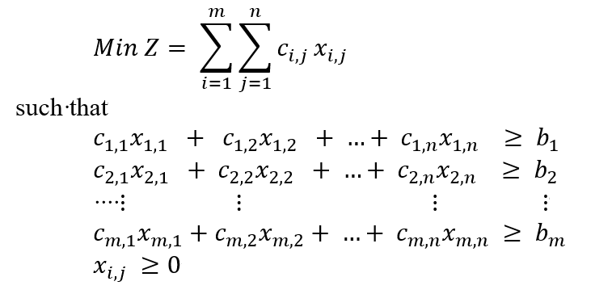
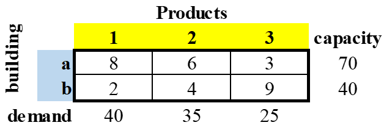
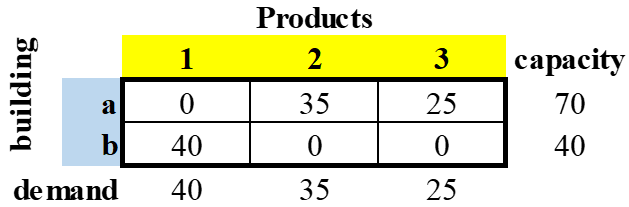
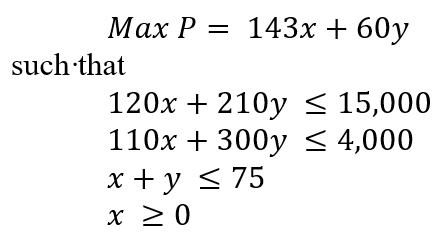
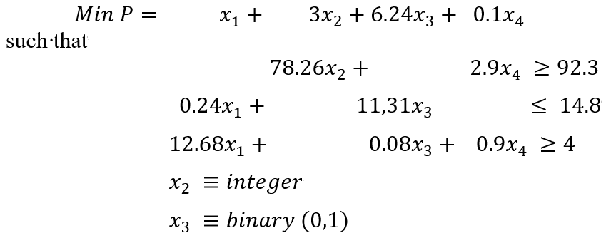

```{r setup, include=FALSE}

#####Make sure you load any required packages.

knitr::opts_chunk$set(echo = TRUE, warning = FALSE)
```


## Purpose.

To use linear program techniques to calculate minimum or maximum values of a constrained objective function. Three examples are provided for Integer Programming (IP), Linear Programming (LP), and Mixed-Integer Linear Programming (MILP) techniques.

## (Linear) Integer Programming (IP) Model

To solve the following capacity (items per building) versus demand (product items) to minimize resources (hours). This follows the following mathematical operations:

<div align="center">
```{r image1,fig.align="center", echo=FALSE}
####Add Image of data


```
</div>

The example uses the following data for three products (1, 2, 3), each with separate demands (40, 35, 25) in two buildings (a, b), each with separate capacities (70, 40).  For each of the buildings, there is an anticipated cost to produce the products, which could be the quantity of people or work hours.  In this example, the costs to produce products 1, 2, and 3 in building a is 8, 6, and 3.  For building b, it's 2, 4, and 9.

<div align="center">
```{r image2,fig.align="center", echo=FALSE}
####Add Image of data


```
</div>

```{r IP,fig.align="center", echo=TRUE, warning = FALSE, message=FALSE}
library(lpSolve)
#
#defining parameters
#origins run i in 1:m
#destinations run j in 1:n
#
obj.fun <- c(8, 6, 3, 2, 4, 9)
m <- 2
n <- 3
constr <- matrix (0, n+m, n*m)
for (i in 1:m){
     for (j in 1:n){
          constr[i, n*(i -1) + j] <- 1
          constr[m+j, n*(i -1) + j] <- 1
     }
}
constr.dir <- c(rep("<=", m), rep(">=", n))
rhs <- c(70 , 40, 40, 35, 25)
#
#solving model
#
prod.sol <- lp("min", obj.fun, constr, constr.dir, rhs, compute.sens = TRUE)
#
#accessing to R output
#
# prod.sol$objval       #objective function value
# prod.sol$solution     #decision variables values
# prod.sol$duals        #includes duals of constraints and reduced costs of variables
#
#sensibility analysis results
#
# prod.sol$duals.from
# prod.sol$duals.to
# prod.sol$sens.coef.from
# prod.sol$sens.coef.to
```

The outcome of this minimized efforts results in the following output, providing us an objective value of 365.

<div align="center">
```{r image3,fig.align="center", echo=FALSE}
####Add Image of data


```

</div>

## Linear Programming (LP) Model

To solve the following scheduling of worker hours for two types of employees (x and y) based upon four constraints to maximize production (items). This follows the following mathematical operations:

<div align="center">
```{r image4,fig.align="center", echo=FALSE}
####Add Image of data


```
</div>

```{r LP,fig.align="center", echo=TRUE, warning = FALSE, message=FALSE}
library(lpSolveAPI)
invisible({capture.output({
  P <- make.lp(0, 2)
lp.control(P, sense = "max", verbose = "neutral")
set.objfn(P, c(143, 60))
add.constraint(P, c(120, 210), "<=", 15000)
add.constraint(P, c(110, 30), "<=", 4000)
add.constraint(P, c(1, 1), "<=", 75)
#P                                          # display LP problem
solve(P)
# get.objective(P)                            # display objective function value
# get.variables(P)                            # display values of the variables
})})
```

The objective function calculates to <b>6315.625 items</b>, with the variables being <b>21.875 hours</b> for x and <b>53.125 hours</b> for y..

## Mixed-Integer Linear Programming (MILP) Model

To solve a mix of numeric, integer, and binary variables. This follows the following mathematical operations:

<div align="center">
```{r image5,fig.align="center", echo=FALSE}
####Add Image of data


```
</div>

```{r MILP,fig.align="center", echo=TRUE, warning = FALSE, message=FALSE}
invisible({capture.output({
P <- make.lp(3,4)                               # matrix with 3 constraints, 4 variables
set.column(P, 1, c(0, 0.24, 12.68))             # set first column of constraints (x1)
set.column(P, 2, 78.26, indices = 1)            # set second column of constraints (x2)
set.column(P, 3, c(11.31, 0.08), indices = 2:3) # set third column of constraints (x3)
set.column(P, 4, c(2.9, 0.9), indices = c(1,3)) # set fourth column of constraints (x4)
set.objfn(P, c(1, 3, 6.24, 0.1))                # set objective function
set.constr.type(P, c(">=", "<=", ">="))         # set constraint types (more, less, equal to)
set.rhs(P, c(92.3, 14.8, 4))                    # set constraint limits
set.type(P, 2, "integer")                       # set variable X2 to integer type
set.type(P, 3, "binary")                        # set variable X3 to integer type
#
#   Set lower limits for X1 and X4 as 28.6 and 18 respectively
#   Set upper limit for X4 as 48.98
#
set.bounds(P, lower = c(28.6, 18), columns = c(1, 4))
set.bounds(P, upper = 48.98, columns = 4)
RowNames <- c("Constraint1","Constraint2","Constraint3")
ColNames <- c("X1","X2", "X3", "X4")
dimnames(P) <- list(RowNames, ColNames)
#P                                              # display the MILP problem
solve(P)
# get.objective(P)                                # display objective function value
# get.variables(P)                                # display values of the variables
# get.constraints(P)                              # display values of the constraints
})})
```

The objective function calculates to <b>31.78276</b>, with the variables being <b>28.6, 0, 0,</b> and <b>31.82759</b>. Also, the constraint values are <b>92.3, 6.864,</b> and <b>391.2928</b>.
