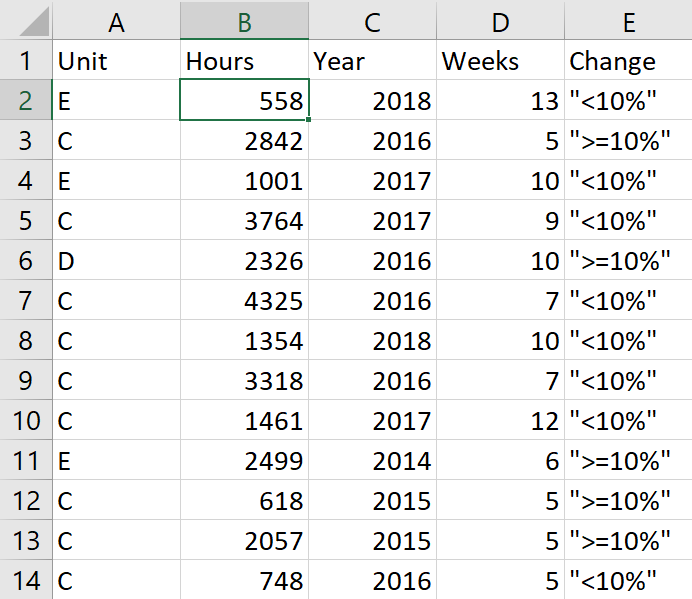

```{r setup, include=FALSE}

#####Make sure you load any required packages.

knitr::opts_chunk$set(echo = TRUE, warning = FALSE)
```


## Purpose.
To structure a sequence of questions, the answers to which determine what the next question, if any should be.  The result of these questions is a tree-like structure where the ends are terminal nodes at which point there are no more questions. An example is provided with un-ordered data intermixed with continuous data, which applies the Classification and Regression Tree method to account for the different types of data in the analysis. The following is a snapshot of the data used for this example containing these attributes:

* <b>Unit</b>: This is the organization where the work was performed.
* <b>Hours</b>: This is the amount of time in chargeable hours to complete the work.
* <b>Year</b>: This is the year when the work was performed.
* <b>Weeks</b>: This is the duration in weeks it took to complete the work.
* <b>Change</b>: This represents the percentage change in the chargeable hours executed compared to the planned or scheduled hours.

<div align="center">
```{r image0,fig.align="center", echo=FALSE}

```
</div>

## Facet Grid Plot of the Data
The following script retrieves the data and constructs a facet grid scatter plot of the data to visually analyze the data for potential information that can be quickly obtained. This script depicts small changes (less than 10%) in the hours as <font color = #006400><b>GREEN</b></font> with the rest as <font color = #9B000><b>RED</b></font> for large changes.

```{r ML1,fig.align="center", echo=TRUE, warning = FALSE, message=FALSE}
if (!require("pacman")) install.packages("pacman")
pacman::p_load(ggplot2, rpart, rpart.plot)
df <- read.csv("tree.csv")
ggplot(df, aes(x=Hours, y=Weeks)) + 
  geom_point(aes(color=Change)) + 
  ggtitle("Production Plot") +
  facet_grid(Unit ~ Year) + 
  xlab("Production Size (hours)") +
  ylab("Production Duration (weeks)") + 
  theme(axis.text.x=element_text(angle=90, 
                                 hjust=1, 
                                 vjust=0.5),
        plot.title = element_text(hjust=0.5)) +
  scale_color_manual(values=c('#006400','#9B0000'))
```

The above plot is a set of 25 graphs displaying the small and large schedule changes for differences in four variables (duration, hours, year, and unit). Just looking at these graphs alone doesn’t readily provide information on when to predict runs with small schedule changes. However, it appears that many of the large changes reside within units A and B.  It also looked like there were some problems with unit D in 2015. 

## Decision Tree
These trees use a flowchart structure where each node on the tree denotes a statistical or probability test with each branch representing the outcome. The following script uses the classification and regression tree method, which combines two type of decision trees. The classification decision tree uses un-ordered values (ie Units) with dependent variables. The regression decision tree uses continuous values (ie Hours and Weeks).

```{r ML2,fig.align="center", echo=TRUE, warning = FALSE, message=FALSE}
ProdTree<-rpart(Change ~  Hours + Weeks + Unit + Year,
                data=df,
                cp=0.01)
prp(ProdTree, 
    extra = 4, 
    box.palette = c("palegreen3", "pink"), 
    main="Production Schedule Tree")
```

This decision tree provides more information than just a scatter plot.  From this tree, 60% of the production runs in units A and B had large changes.  Also, 62% of the production runs in unit D that had 3,706 hours or more had large changes.  This tree also indicated that the attributes for years and duration had little impact on determine when their might be a production problem.  With this information, production leaders can focus their valuable time trying to improve their operations by focusing upon these three areas having schedule problems.
