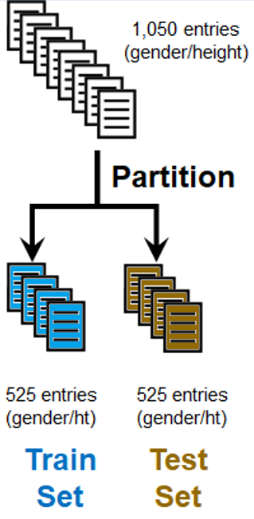
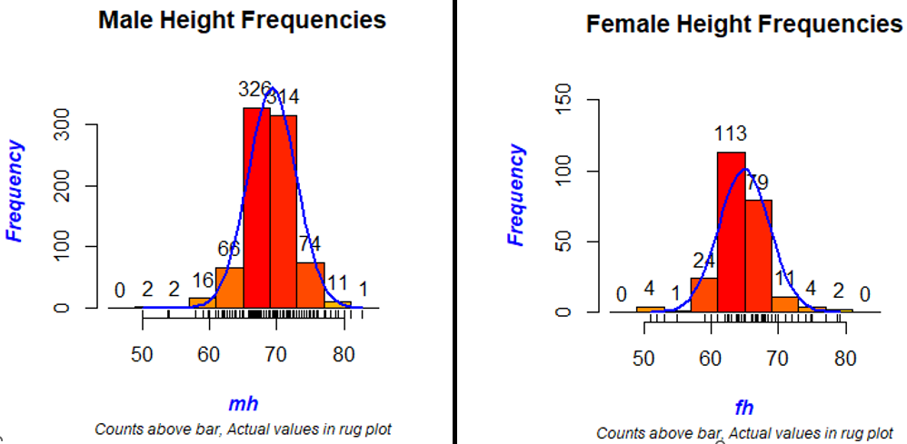
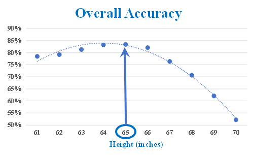
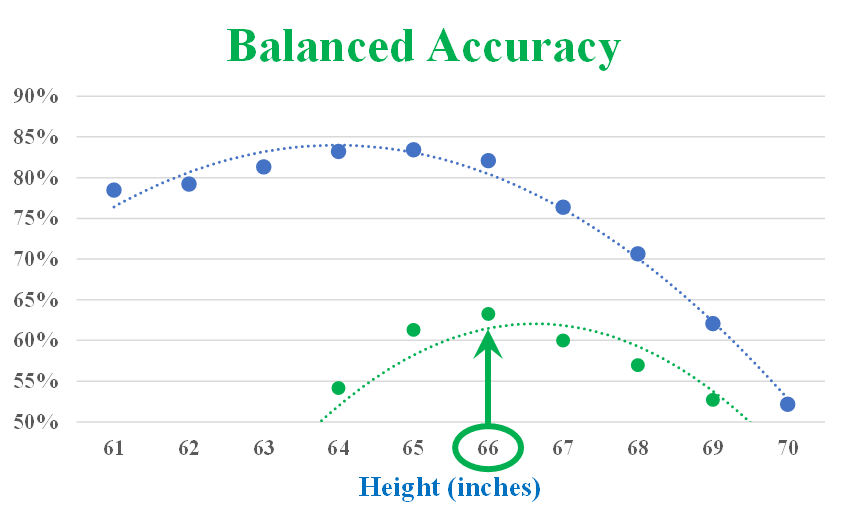
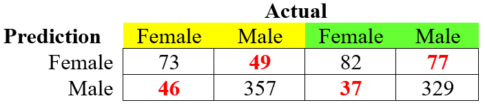
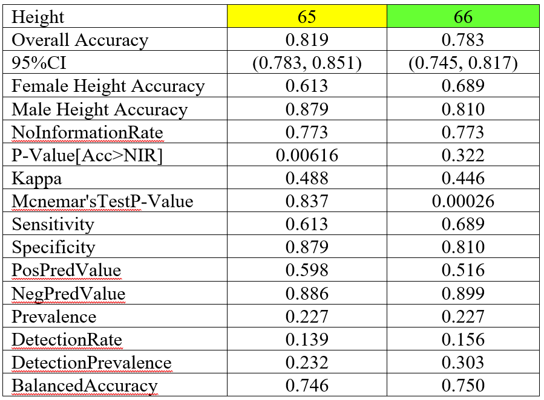

```{r setup, include=FALSE}

#####Make sure you load any required packages.

knitr::opts_chunk$set(echo = TRUE, warning = FALSE)
```


## Purpose.

To use simple machine learning concepts involving an imbalanced dataset, one that contains skewed class proportions. An extreme example would be one with <b>99%</b> of the data representing a majority class and <b>1%</b> a minority one. Throwing this data into a machine learning algorithm might provide the wrong prediction when it completely ignores the minority class, predicting that all members of this dataset were majority members, demonstrated with a <b>99%</b> overall accuracy. Methods to offset this imbalance includes sampling techniques and modeling evaluation techniques. In this example, I applied a balanced approach to maximize the average for each class, comparing it to the maximum accuracy for the overall dataset.

This example uses the <i>heights</i> dataset that is part of the <i>dslabs</i> (Data Science Labs) packet. This dataset contains 1,050 self-reported heights in inches for males and females. In this script as illustrated in the following image, I partitioned the data by half, creating a train set to develop the model and a test set to assess the model.

<div align="center">
```{r image0,fig.align="center", echo=FALSE}
####Add Image of data

```
</div>


```{r ML1,fig.align="center", echo=TRUE, warning = FALSE, message=FALSE}
if (!require("pacman")) install.packages("pacman")
pacman::p_load(caret, dslabs, foreach, generics, gower, ipred, iterators, lava,
               ModelMetrics, prodlim, purrr, recipes, rlang, tibble, timeDate)
#
# Create 2 data sets, a Training set and a Test set to compute Overall Accuracy
#
y <- heights$sex
x <- heights$height
set.seed(2)
test_index <- createDataPartition(y,
                                  times=1,
                                  p=0.5,
                                  list=FALSE)
train_set <- heights[-test_index,]
test_set <- heights[test_index,]
#
# Calculate mean and standard deviation of Train set
#
heights %>% group_by(sex) %>% 
  summarize(number = n(),
            mean = round(mean(height), 1),
            std_dev = round(sd(height), 1))

```

As seen in the above table, the Male population is nearly three-fourths of the overall population.  Furthermore, the mean for each class (Male and Female) is within one standard deviation from each other. The following is a graphical representation of this data.  As can be seen in these plots, there is a large overlap of the data, making it difficult to conclusively predict the gender based solely upon their heights, especially for an imbalanced dataset.

<div align="center">
```{r image1,fig.align="center", echo=FALSE}
####Add Image of data


```
</div>

## Best Cutoff of Train Set for Maximum Accuracy
The following script uses a variety of heights ranging from <b>61</b> to <b>70</b> inches and selects the best value for maximum overall accuracy.

```{r ML2,fig.align="center", echo=TRUE, warning = FALSE, message=FALSE}
#
# pick best cutoff from heights between 61 and 70 [OVERALL ACCURACY]
#
cutoff <- seq(61,70)
accuracy <- map_dbl(cutoff,
                    function(x){
                      y_hat <- ifelse(train_set$height>x,
                                      "Male",
                                      "Female") %>%
                        factor(levels=levels(test_set$sex))
                      mean(y_hat==train_set$sex)
                      }
                    )
max <- max(accuracy)                          # accuracy for correct prediction
best_cutoff <- cutoff[which.max(accuracy)]    # height in inches
text1 <- paste("Cut-off of",
               best_cutoff, 
               "inches yields", 
               round(max,3), 
               "accuracy.")
print(text1)
```

The calculated value of <b>83.4%</b> accuracy from the above script resulted in a height of <b>65</b> for the best cutoff. From this, we can predict that those with heights of <b>65</b> inches or greater would be Males and those less than that would be Females.  Graphically, this is represented by the following plot with the maximum value of the curve occurring at the value of <b>65</b>.

<div align="center">
```{r image2,fig.align="center", echo=FALSE}
####Add Image of data


```
</div>

## Tested Accuracy based upon Cutoff Value of 65
The following script calculates the accuracy of the test set using the maximum accuracy from the train set.

```{r ML3,fig.align="center", echo=TRUE, warning = FALSE, message=FALSE}
#
# Calculation of model accuracy on Test set [height of 64]
#
y_hat <- ifelse(test_set$height > best_cutoff, 
                "Male",
                "Female") %>%
  factor(levels = levels(test_set$sex))
y_hat <- factor(y_hat)
max <- mean(y_hat == test_set$sex)
text1 <- paste("Cut-off of",
               best_cutoff, 
               "inches yielded", 
               round(max,3), 
               "accuracy in test dataset.")
print(text1)
```

This test set accuracy of <b>81.9%</b> is slightly lower than the anticipated accuracy of <b>83.4%</b> from the train set.

## Confusion Matrix
The following script calculates the confusion matrix of the test set, displayed as a table that lists the performance of the classification algorithm.  Key components of this matrix includes the following items:

* <u>Accuracy</u>: This is the fraction of (true positive (TP) + true negative (TN)) / (false positive (FP) + false negative (FN)).
* <u>95% Confidence Interval (CI)</u>: This is the range of accuracy values within a 95% interval.
* <u>No Information Rate</u>. This represents the proportion of the largest (or majority) class.
* <u>P-Value</u>: This represents a one-sided test to see if the accuracy was better than the "No Information Rate."
* <u>Kappa</u>: This is a measure of the agreement between the classification and actual values.  A score of less than 0.4 is considered a poor agreement, whereas those greater than 0.75 are excellent.
* <u>McNemar's Test P-Value</u>: Similar to a paired-samples t-test, this determines if there are differences on a dichotomous dependent variable between two related groups. In the end, if the p-value is less 0.05, there is a significant difference between FN and FP values.
* <u>Sensitivity</u>: Measures the proportion of the positive class that is correctly predicted as positive. <i>[NOTE: The Female class was the positive class for this matrix.]</i>
* <u>Specificity</u>: Measures the proportion of the negative class that is correctly predicted as negative.
* <u>Prevalence</u>: This represents the proportion of the smallest (or minority) class.
* <u>Detection Rate</u>: This is the fraction of the positive class that was correctly predicted.
* <u>Detection Prevalence</u>: This is the fraction of the positive class that was predicted.
* <u>Balanced Accuracy</u>: This is the average of Sensitivity and Specificity.

```{r ML4,fig.align="center", echo=TRUE, warning = FALSE, message=FALSE}
#
# Confusion Matrix
#
caret::confusionMatrix(data = y_hat, 
                       reference = test_set$sex)
```

## Balanced Accuracy Approach
As seen in the confusion matrix, the accuracy for Females was <b>61.3%</b> as compared to an accuracy of <b>87.9%</b> for Males, which occurred since there were more Males than Females.  Since this was biased to the gender with the most population, the model becomes biased as well. To alleviate this issue, a more balanced approach was needed. This revised approach maximizes the balanced accuracy, values calculated in the confusion matrix. The following script below applies the balanced accuracy approach to provide a better accuracy for Females by reducing the accuracy for Males.

```{r ML5,fig.align="center", echo=TRUE, warning = FALSE, message=FALSE}
#
# pick best cutoff from heights between 61 and 70 [BALANCED ACCURACY]
#
cutoff <- seq(61,70)
F_1 <- map_dbl(cutoff, 
               function(x){
                 y_hat <- ifelse(train_set$height > x, 
                                 "Male", 
                                 "Female") %>%
                   factor(levels = levels(test_set$sex))
                 F_meas(data=y_hat, 
                        reference = factor(train_set$sex)) 
                 }
               )
best_cutoff<-cutoff[which.max(F_1)]
text1 <- paste("Cut-off of",
               best_cutoff, 
               "inches yields", 
               round(max(F_1),3), 
               "balanced accuracy.")
print(text1)
```

The calculated value from the above script resulted in a value of <b>66</b> inches for the best cutoff using a balanced approach.  Graphically, this is represented by the following with the maximum value of the balanced accuracy curve occurring at the value of <b>66</b> (superimposed on the previous graph for overall accuracy).

<div align="center">
```{r image3,fig.align="center", echo=FALSE}
####Add Image of data

```
</div>

## Tested Accuracy based upon Cutoff Value of 66
The following script assesses the result of this using the test set and calculates the associated confusion matrix.


```{r ML6,fig.align="center", echo=TRUE, warning = FALSE, message=FALSE}
#
# Calc of model accuracy on Test set [height of 66] 
#
y_hat <- ifelse(test_set$height > best_cutoff,
                "Male",
                "Female") %>% 
  factor(levels = levels(test_set$sex))
caret::confusionMatrix(data = y_hat, 
                       reference = test_set$sex)
```

This balanced approach resulted in an overall accuracy of <b>78.3%</b> with a balanced accuracy of <b>75.0%</b>, which raised the Female accuracy to <b>68.9%</b> and reduced the Male accuracy to <b>81.0%</b>.

## Conclusion
As seen from the data below, we had an imbalance in the data set with significantly more data for Males than for Female. The accuracy calculations for the test set for the maximum accuracy approach were in the amber color-coded columns and the balanced accuracy approach were in the green columns of the following two tables.  The first table below lists the actual values compared to the predicted numbers with the false numbers highlighted in <b><font color="red">BOLD RED</font></b> font. In the balanced approach, the number of correctly identified Females rose from <b>73</b> in the maximum accuracy approach to <b>82</b>.

<div align="center">
```{r image4,fig.align="center", echo=FALSE}
####Add Image of data

```
</div>

In the confusion matrix table below, the overall accuracy dropped by nearly <b>4%</b> from <b>81.9%</b> for the maximum accuracy approach to <b>78.3%</b> for the balanced accuracy approach. This reduction in overall accuracy, increased the prediction of the minority class (Females) by more than <b>8%</b>.

<div align="center">
```{r image5,fig.align="center", echo=FALSE}
####Add Image of data

```
</div>

Final comment is that <b><font color="green">it's not the accuracy of the model that matters, which is the pursuit of the maximum accuracy percentage, but the right accuracy of the model, one that considers all groups within a data set</font></b>.