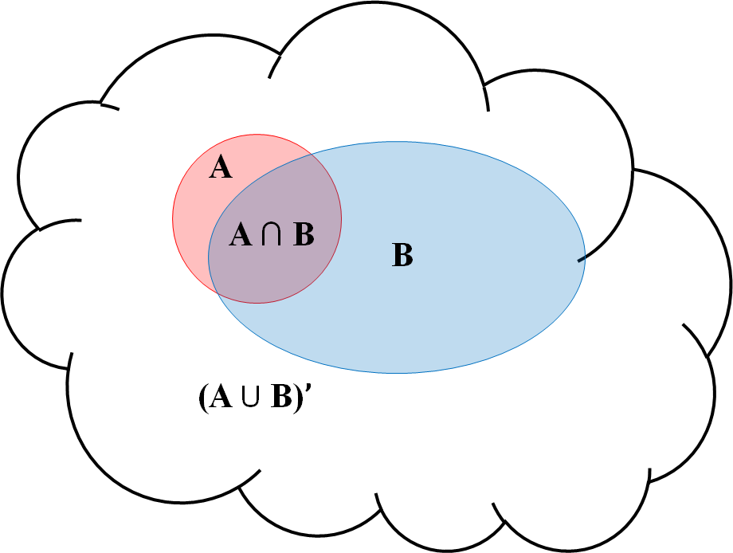
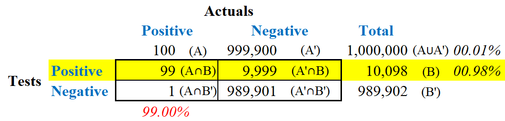

```{r setup, include=FALSE}

#####Make sure you load any required packages.

knitr::opts_chunk$set(echo = TRUE, warning = FALSE)
```

## Purpose.
To conduct linear regression of data using two general approaches - Frequentist and Bayesian. The Frequentist approach conducts hypothesis testing using P values and confidence intervals, which are well-established throughout the scientific community for decades.  However, it isn't able to address order, inequality, and direction for its hypothesis.  Nor, does it consider prior knowledge. Lately, scientific articles using Bayesian methods have increased.

## Frequentist Regression.
This method assumes a null hypothesis to be true prior to data collection. This results in probabilistic statements, defined as P values, that indicates the probability of obtaining another data set as the one being analyzed.  Additionally, a 95% confidence interval is obtained that indicates if one were to repeat the experiment multiple times, 95% of the computed intervals would contain the true mean^[Fornacon-Wood, Isabella; Mistry, Hitesh; Johnson-Hart, Corinne; Faivre-Finn, Corinne; O'Connor, James P.B.; and Price, Gareth J. (April 1, 2022), "[Understanding the Differences Between Bayesian and Frequentist Statistics](https://doi.org/10.1016/j.ijrobp.2021.12.011)," <i>International Journal of Radiation Oncology, Biology, Physics</i> volume 112, number 5 pp. 1076-1082.].

## Frequentist Method

```{r Sta1,fig.align="center", echo=TRUE, warning = FALSE, message=FALSE}
.libPaths("C:/R/Library")
rm(list = ls())
if (!require("pacman")) install.packages("pacman")
pacman::p_load(bayesplot, bayestestR, broom, flextable, ggplot2, insight, mlbench, 
               modelsummary, report, rstanarm, tidyverse)
#
#  Create multiplot function
#
multiplot <- function(..., plotlist=NULL, file, cols=1, layout=NULL) {
  require(grid)
  plots <- c(list(...), plotlist)
  numPlots = length(plots)
  if (is.null(layout)) {
    layout <- matrix(seq(1, cols * ceiling(numPlots/cols)),
                    ncol = cols, nrow = ceiling(numPlots/cols))
  }
 if (numPlots==1) {
    print(plots[[1]])
  } else {
    grid.newpage()
    pushViewport(viewport(layout = grid.layout(nrow(layout), ncol(layout))))
    for (i in 1:numPlots) {
       matchidx <- as.data.frame(which(layout == i, arr.ind = TRUE))
      print(plots[[i]], vp = viewport(layout.pos.row = matchidx$row,
                                      layout.pos.col = matchidx$col))
    }
  }
}
#
# Load data
#
df1 <- read.csv("lm1.csv")
variables <- df1[,-3]
model_lm<-lm(y~., data=df1)
ft <- as_flextable(model_lm) %>%
  theme_vanilla() %>%
  set_caption(caption = as_paragraph(
    colorize(as_b("Frequentist Regression Model"), color="blue"))) %>%
  bg(j = c(5),
     bg="yellow",
     part="body") %>%
  color(j = c(5),
        color="red",
        part="body") %>%
  colformat_double(digits=4)
ft
```
<br>
The above table provides the following linear regression model with each of the three coefficients having a p value less than 0.05 (highlighted in <b><font color="red">RED</font> font with yellow background</b>), indicating that each are statistically significant using Frequentist terminology.  The adjusted R square is 0.499, meaning that about half of the variability in the prediction is explained by the regression model.

<div align="center">
$$\begin{equation}
  Y = 36.1907 + 0.4486X_{1} - 0.2215X_{2}
\end{equation}$$
</div>

## Bayes Method.
This method updates probabilities based on data and past knowledge. Unlike the Frequentist method, parameters and hypotheses are seen as probability distributions while the data is fixed. In essence, probability depends on prior information. As such, the strength of the Bayesian method is the use of prior information and its ability to calculate probabilities of different hypotheses from the posterior distribution^[Fornacon-Wood, Isabella (2022).]. The informative hypotheses for this method includes equality of means, order of means, greater/less than (+/-), effect size, and multiple hypotheses.

Considering a simple venn diagram of two groups (A and B) within a sampling population as depicted below. From a Frequentist view after defining A as a population trait and B as a positive detection that a tested sample possesses that trait, the probability that an individual has the trait can be assumed to be the intersection of A with B (A<span>&#8745;</span>B) divided by A - this could be the accuracy of the detection test.  In essence, this can answer the question <i><b>"what is the probability that the detection test correctly identifies a person with the trait A?"</b></i>

<div align="center">
```{r image1,fig.align="center", echo=FALSE}

```
</div>

Considering the above venn diagram, an example for a method to test one million people is used to determine if someone has a particular trait (or disease), trait A, with a 99% accuracy for both positive and negative results. Using prior information that having the trait is 0.01% (or one in ten thousand), there should be one hundred with the trait and 999,900 without it^[Hackenberger, Branimir K. (February 2019), "[Bayes or not Bayes, is this the
question?](https://doi.org/10.3325/cmj.2019.60.50)," <i>Croatian Medical Journal</i> volume 60, number 1 pp. 50-52.]. Most people, including many within the healthcare industry, would assume that anyone testing positive on a test having 99% accuracy would also have a 99% probability of possessing the trait (see below table, highlighted in <b><font color="red">RED</font></b>). However, using Bayesian terminology, the correct question ought to be <i><b>"what is the probability of having the trait considering they tested positive?"</b></i> As seen in the table, the test incorrectly identified 1% of the population that did not have the trait, identifying 9,999 (A'<span>&#8745;</span>B) of them with the trait (ie false positive), resulting in 10,098 of the population testing positive. The answer to this question is 99 (A<span>&#8745;</span>B) with the trait divided by the total of 10,098 (B), resulting in 0.98%.  As such, more than 99% of those testing positive for the trait didn't have it.

<div align="center">
```{r image2,fig.align="center", echo=FALSE}

```
</div>

Like all analyses, one should not assume a Bayesian analysis will solve problems involving insufficient, poor-quality, or incorrectly recorded data because the most important requirement for analyses is still data quality. Furthermore, there is no prescribed method for choosing prior conditions such that different people can use different ones for the same experiments and obtain different posteriors, leading to different conclusions.

## Bayes Regression Distribution Plots
Some of the codes are described by R-bloggers^[Modeling with R (April 24, 2020), "[Bayesian linear regression](https://www.r-bloggers.com/2020/04/bayesian-linear-regression/)," <i>R-bloggers</i>].

```{r Sta2,fig.align="center", echo=T, warning = F, results = 'hide', message=F}
model_bayes <- stan_glm(y~., data=df1, seed=111)
plot1 <- mcmc_dens(model_bayes, 
                   pars = c("x1")) +
  vline_at(0.4486, 
           col="red")
plot2 <- mcmc_dens(model_bayes, 
                   pars=c("x2")) +
  vline_at(-0.2215, col="red")
plot3 <- mcmc_dens(model_bayes, 
                   pars=c("sigma")) +
  vline_at(14.276, col="red")
multiplot(plot1, plot2, plot3, cols=3)     # plot both graphs side-by-side
```
<br>
In the above three plots of the two attributes (x1 and x2) and the sigma values, none have a completely normal distribution density. Although these are close to being normal, the use of the Bayesian method could provide a slight improvement of the predictions.

## Bayes Regression Model Report
The following code prints a written report of the model.

```{r Sta3,fig.align="center", echo=T, warning = F, results = 'hide', message=F}
r<-report(model_bayes)
summary(r)
```
<br>
`r summary(r)`

## Bayes Regression Model Table
The following code prints a table of the model.

```{r Sta4,fig.align="center", echo=T, warning = F, results = T, message=F}
r1 <- as.data.frame(r)
ft <- flextable(r1) %>%
  theme_vanilla() %>%
  set_caption(caption = as_paragraph(
    colorize(as_b("Bayes Linear Regression Model"), color="blue"))) %>%
  bg(j = c(4,5),
         i = c(1:3),
         bg="yellow",
         part="body") %>%
  color(j = c(4,5),
        i = c(1:3),
        color="red",
        part="body") %>%
  colformat_double(digits=4)
ft
```
<br>
Expected log-predictive density (ELPD) is -601.7, which measures the average log predictive density across all possible new data points with high values indicating greater predictive accuracies. The leave-one-out cross-validation information criterion (LOOIC), which is -2 times the value of ELPD, and the widely applicable information criterion (WAIC), with a value of slightly smaller than the LOOIC, are used to estimate pointwise out-of-sample prediction accuracy^[Vehtari, Aki; Gelman, Andrew; and Gabry, Jonah (12 September 2016), [Practical Bayesian model evaluation using leave-one-out cross-validation and WAIC](https://doi.org/10.1007/s11222-016-9696-4) <i>Statistics and Computing</i> volume 27, Issue 5, pp 1413-1432]. The adjusted R square value of 0.494 indicates that about half of the variability in the prediction is explained by the regression model.  The associated model equations for this along with the max and min values representing the 95% confidence limits are:

<div align="center">
$$\begin{equation}
  Y = 36.2383 + 0.4483X_{1} - 0.2214X_{2}
\end{equation}$$
</div>

<div align="center">
$$\begin{equation}
  Y_{min} = 28.7338 + 0.3675X_{1} - 0.3086X_{2}
\end{equation}$$
</div>

<div align="center">
$$\begin{equation}
  Y_{max} = 43.6639 + 0.5288X_{1} - 0.1316X_{2}
\end{equation}$$
</div>

## Regression Models Comparison
The following code prints a table comparing Frequentist and Bayes models, including the lower and higher values based upon the 95% confidence levels.  It also includes the difference (delta) between both models.

```{r Sta5,fig.align="center", echo=T, warning = F, results = T, message=F}
actual <- df1[,3]
pred_lm <- predict(model_lm, newdata=variables)
pred_bayes <- predict(model_bayes, newdata=variables)
df1$lm <- pred_lm
df1$bayes <- pred_bayes
df1$bayes_low <- 28.7338 + 0.3675*variables$x1 - 0.3086*variables$x2
df1$bayes_high <- 43.6639 + 0.5288*variables$x1 - 0.1316*variables$x2
values1 <- data.frame(actual,pred_lm,pred_bayes)
values1 <- cbind(values1, df1$bayes_low, df1$bayes_high)
values1$delta <- values1$pred_lm - values1$pred_bayes
colnames(values1) <- c("Actual","Frequentist", "Bayes", "Bayes_low", 
                       "Bayes_high", "Delta")
values1 <- values1[order(values1$Actual),]  # reorder by increasing Actual
ft <- flextable(rbind(head(values1), tail(values1))) %>%
  theme_vanilla() %>%
  set_caption(caption = as_paragraph(
    colorize(as_b("Regression Models"), color="blue"))) %>%
  bg(j = c(4,5),
     bg="yellow",
     part="body") %>%
  colformat_double(digits=4)
ft
```
<br>
The above table displays the first six and last six rows with the Bayes 95% confidence level values highlighted in yellow.  Based upon the delta values, indicating the difference between both models, it appears that the Bayes model provides a slightly lower value for low attributes values and slightly higher value for high attribute values.  These slight changes provide a more realistic prediction towards the limits of the data values.

## Regression Model Plots
The following code prints two plots.  The first one displays the delta points, representing the difference between the Bayes and Frequentist models.  The second one displays the Bayes predicted values compared to the actuals values, including the upper and lower 95% confidence levels.

```{r Sta6,fig.align="center", echo=T, warning = F, results = T, message=F}
plot1 <- ggplot(values1, aes(Actual)) +
  ggtitle("Regression Models Delta") + 
  geom_point(aes(y=Delta, color="darkred")) +
  theme(plot.title = element_text(color="#0000FF", 
                                  face="bold", 
                                  size=15, 
                                  hjust=0.5),
        axis.title.x = element_text(size=14, 
                                    face="bold", 
                                    color="black"),
        axis.title.y = element_text(angle=0,
                                    size=14, 
                                    face="bold", 
                                    color="black"),
        axis.text.x = element_text(hjust = 1, 
                                   face="bold",
                                   color="black",
                                   size=12),
        axis.text.y = element_text(angle=0,
                                   vjust = 1, 
                                   face="bold",
                                   color="black",
                                   size=12),
        legend.position = "none",
        panel.background = element_blank())

plot2 <- ggplot(values1, aes(Actual)) +
  ggtitle("Bayes Regression Model") + 
  geom_point(aes(y=Bayes, color="darkred")) +
  geom_smooth(aes(y=Bayes_low), se=F) + 
  geom_smooth(aes(y=Bayes_high), se=F) + 
  geom_abline(linetype = "dashed", size=1.1) +
  ylim(0,100) +
  theme(plot.title = element_text(color="#0000FF", 
                                  face="bold", 
                                  size=15, 
                                  hjust=0.5),
        axis.title.x = element_text(size=14, 
                                    face="bold", 
                                    color="black"),
        axis.title.y = element_text(angle=0,
                                    size=14, 
                                    face="bold", 
                                    color="black"),
        axis.text.x = element_text(hjust = 1, 
                                   face="bold",
                                   color="black",
                                   size=12),
        axis.text.y = element_text(angle=0,
                                   vjust = 1, 
                                   face="bold",
                                   color="black",
                                   size=12),
        legend.position = "none",
        panel.background = element_blank())
multiplot(plot1, plot2, cols=2)     # plot both graphs side-by-side
```
<br>
Based upon the above two plots, the Bayesian model provides a slightly lower prediction for lower values and a slightly higher value for larger values.  As seen in the second plot with the black dashed abline, the predicted values remain distant from the actual ones even though the Bayesian model predicts values slightly closer to them.

An excellent book that describes the problems of the Frequentist method is Aubrey Clayton's 2021 book <i>Bernoulli's Fallacy</i>^[Clayton, Aubrey (2021), [Bernoulli's Fallacy: Statistical Illogic and the Crisis of Modern Science](https://www.google.com/books/edition/Bernoulli_s_Fallacy/HzQGEAAAQBAJwwwwww) New York, NY: Columbia University Press.]. Additionally, R scripts for Bayesian regression can be found in a recent <i>Towards Data Science</i> article^[Zhang, Liyi (March 24, 2020), [Bayesian regression with implementation in R: Theoretical derivations from scratch, R implementation, and discussion of the Bayesian view](https://towardsdatascience.com/bayesian-regression-with-implementation-in-r-fa71396dd59e) <i>Towards Data Science</i>.].

## Notes