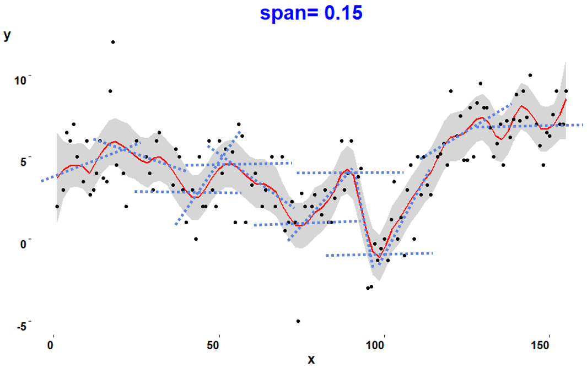

```{r setup, include=FALSE}

#####Make sure you load any required packages.

knitr::opts_chunk$set(echo = TRUE, warning = FALSE)
```


## Purpose.

To conduct local regression smoothing plots of data on x-y axis using LOESS (locally estimated scatter-plot smoothing). Different values for span are used to demonstrate this parameter for smoothing the curve that represents the scatter of data.  The default value is 0.75 So, the primary question becomes: <i>"What size span should I use?"</i> One method demonstrated is to use a visual interpretation using different span values and choosing the one with the least amount of smoothing that appears appropriate to the analysis. Other methods include calculations, such as cross validation (CV) and Generalized Cross Validation (GCV). A quick GCV approach is used to select the best span value in this example.

The span, ranging from 0 to 1, provides the proportion of observations used in each local regression.  For a span value of 0.3, each local regression uses 30% of the total data points. The smaller the span, the smaller the amount of data used for each point on the curve, the more jagged, or noisier, it becomes. As seen in the example below, with data points depicted by black circles, the LOESS curve is depicted by a <b><font color="red">RED</font></b> line within a shaded grey area representing the 95% confidence interval region.  This curve was calculated using a span of 0.15, representing 15% of the total data points.  The dotted <b><font color="blue">BLUE</font></b> lines depict slopes the 15% local population that were calculated to generate the curve.

<div align="center">
```{r image0,fig.align="center", echo=FALSE}
####Add Image of data

```
</div>


```{r Sta1,fig.align="center", echo=TRUE, warning = FALSE, message=FALSE}
if (!require("pacman")) install.packages("pacman")
pacman::p_load(caret, dplyr, dslabs, foreach, generics, ggplot2, gower, grid, 
               HistData, ipred, iterators, lava, ModelMetrics, prodlim, purrr, 
               recipes, rlang, timeDate)
data <- read.csv(file = "smooth.csv")
span<-c(1, .5, .3, .15, .1, .05)    # six different span values to consider
#
# create different plots with different spans
#
myplots <- list()
for (i in 1:6){
  title <- paste("span=", span[i])
  plot1 <- ggplot(data, aes(x, y)) +
    ggtitle(title) + 
    geom_smooth(color = "red", 
                span = span[i], 
                method = "loess") +
    geom_point() +
    theme(plot.title = element_text(color="#0000FF", 
                                    face="bold", 
                                    size=22, 
                                    hjust=0.5),
          axis.title.x = element_text(size=14, 
                                      face="bold", 
                                      color="black"),
          axis.title.y = element_text(angle=0,
                                      size=14, 
                                      face="bold", 
                                      color="black"),
          axis.text.x = element_text(hjust = 1, 
                                     face="bold",
                                     color="black",
                                     size=12),
          axis.text.y = element_text(angle=0,
                                     vjust = 1, 
                                     face="bold",
                                     color="black",
                                     size=12),
          panel.background = element_blank())
  myplots[[i]] <- plot1
}
myplots[4]
```

In this same plot of the data with a 15% span LOESS curve, we can see that the majority of the data points reside within the shaded 95% confidence interval area.  Furthermore, the curve provides sufficient estimate of <b>y</b> values for selected <b>x</b> variables without it being too jagged.

## Generate multiple plots
The following script applies a multiplot function to print six different plots with varying span values ranging from 0.05 to 1.

```{r Sta2,fig.align="center", echo=TRUE, warning = FALSE, message=FALSE}
multiplot <- function(..., plotlist=NULL, file, cols=1, layout=NULL) {
  require(grid)
  plots <- c(list(...), plotlist)
  numPlots = length(plots)
  if (is.null(layout)) {
    layout <- matrix(seq(1, cols * ceiling(numPlots/cols)),
                     ncol = cols, 
                     nrow = ceiling(numPlots/cols))
  }
  if (numPlots==1) {
    print(plots[[1]])
  } else {
    grid.newpage()
    pushViewport(viewport(layout = grid.layout(nrow(layout), 
                                               ncol(layout))))
    for (i in 1:numPlots) {
      matchidx <- as.data.frame(which(layout == i, 
                                      arr.ind = TRUE))
      print(plots[[i]], vp = viewport(layout.pos.row = matchidx$row,
                                      layout.pos.col = matchidx$col))
    }
  }
}
multiplot(myplots[1], myplots[4], myplots[2], myplots[5], myplots[3],
          myplots[6], cols=3)
```

Based upon a quick scan of the above six plots, one could visually rule out a span of 0.5 or greater for being too broad and not capturing enough of the data, while ruling out a span of 0.05 or lower for being too jagged. Depending upon the needs of the individual (or decisionmaker), one could select a span somewhere between 0.1 and 0.3.  This leaves the choice to the preference of the analyst.

## Generalized Cross Validation (GCV) technique
Generalized Cross Validation (GCV) is powerful approaches used to estimate parameters in the context of inverse problems and regularization techniques, such as the determination of the smoothness parameter (ie span) in curve-fitting techniques. A discussion of this technique can be found in the [Explaining the Generalized Cross-Validation on Linear Models](https://doi.org/10.3844/jmssp.2019.298.307) 2019 article by Chaves et.al in the <i>Journal of Mathematics and Statistics</i>. The following script calculates a GCV estimate for each span, leading to the best span being the one resulting in the minimum GCV value.

The following script is a quick calculation of the GCV value for spans ranging between 0.1 and 0.6.  The final output of this script is a plot of the GCV versus span, with the optimal span value annotated on the graph.

```{r Sta3,fig.align="center", echo=TRUE, warning = FALSE, message=FALSE}
locv1 <- function(x1, y1, nd, span, ntrial) {
  locvgcv <- function(sp, x1, y1) {
    nd <- length(x1)
    assign("data1", data.frame(xx1 = x1, yy1 = y1))
    fit.lo <- loess(yy1 ~ xx1, 
                    data = data1, 
                    span = sp, 
                    family = "gaussian", 
                    degree = 2, 
                    surface = "direct")
    res <- residuals(fit.lo)
    dhat2 <- function(x1, sp) {
      nd2 <- length(x1)
      diag1 <- diag(nd2)
      dhat <- rep(0, length = nd2)
      for(jj in 1:nd2) {
        y2 <- diag1[, jj]
        assign("data1", data.frame(xx1 = x1, yy1 = y2))
        fit.lo <- loess(yy1 ~ xx1, 
                        data = data1, 
                        span = sp, 
                        family = "gaussian", 
                        degree = 2, 
                        surface = "direct")
        ey <- fitted.values(fit.lo)
        dhat[jj] <- ey[jj]
      }
      return(dhat)
    }
    dhat <- dhat2(x1, sp)
    trhat <- sum(dhat)
    sse <- sum(res^2)
    cv <- sum((res/(1 - dhat))^2)/nd
    gcv <- sse/(nd * (1 - (trhat/nd))^2)
    return(gcv)
  }
  gcv <- lapply(as.list(span1), locvgcv, x1 = x1, y1 = y1)
  #cvgcv <- unlist(cvgcv)
  #cv <- cvgcv[attr(cvgcv, "names") == "cv"]
  #gcv <- cvgcv[attr(cvgcv, "names") == "gcv"]
  return(gcv)
}

nd <- length(data$x)
xx <- data$x
yy <- data$y
ntrial <- 50
span1 <- seq(from = 0.1, by = 0.01, length = ntrial)
output.lo <- locv1(xx, yy, nd, span1, ntrial)
gcv <- output.lo
gcv_u <- unlist(gcv)
gcvmin <- seq(along = gcv_u)[gcv == min(gcv_u)]
gcvmax <- max(gcv_u)
span_gcv <- span1[gcvmin]
span_gcv_mid <- mean(span1)
span_gcv_value <- round(min(gcv_u),2)
gcv_df <- cbind(data.frame(span1), data.frame(gcv_u))
text1 <- paste("Span is", span_gcv)
text2 <- paste("GCV is", span_gcv_value)
#
#  plot of the GCV
#
plot1 <- ggplot(gcv_df, aes(span1, gcv_u)) +
    labs(title="Generalized Cross Validation", 
         x="Span",
         y="GCV Value") +
    geom_vline(xintercept=span_gcv, linetype=4, color ="blue", size = 1) +
    geom_label(aes(x=span_gcv, y = gcvmax, label = text1),
             color = "blue", size = 6, angle=0, fill = "white") +
    geom_hline(yintercept=span_gcv_value, linetype=4, color ="blue", size = 1) +
    geom_label(aes(x=span_gcv_mid, y = span_gcv_value, label = text2), hjust=0,
             color = "blue", size = 6, angle=0, fill = "white") +
    geom_smooth(color = "red", 
                span = 0.2, 
                method = "loess") +
    geom_point() +
    theme(plot.title = element_text(color="#0000FF", 
                                    face="bold", 
                                    size=22, 
                                    hjust=0.5),
          axis.title.x = element_text(size=14, 
                                      face="bold", 
                                      color="black"),
          axis.title.y = element_text(angle=0,
                                      size=14, 
                                      face="bold", 
                                      color="black"),
          axis.text.x = element_text(hjust = 1, 
                                     face="bold",
                                     color="black",
                                     size=12),
          axis.text.y = element_text(angle=0,
                                     vjust = 1, 
                                     face="bold",
                                     color="black",
                                     size=12),
          panel.background = element_blank())

plot1
```

The above plot proposes a span of 0.15 since it produced the minimum GCV value of 4.13.  In this example, it would be much better to use a much lower span value than the default value of 0.75.