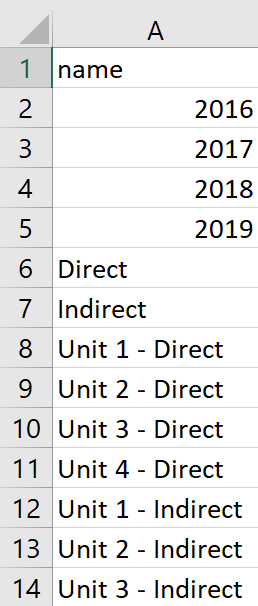

```{r setup, include=FALSE}

#####Make sure you load any required packages.

knitr::opts_chunk$set(echo = TRUE, warning = FALSE)
```


## Purpose.

To portray a graphical representation of the flow of entities (ie money, material, and labor) between nodes, such as processes and organizations.  This uses codes to generate Sankey diagrams, which are visualizations used to depict a flow from one set of values to another in which the things being connected are called nodes and the connections are called links.

## Historical Example
Perhaps the best Sankey diagram was a map Charles Joseph Minard created that combined statistical graphics and thematic mapping together^[Kraak, Menno-Jan (2021). "The best map ever?" <u>International Journal of Cartography</u> 7 (2): 205-210.]. This map (or Sankey diagram) depicts the Frech invasion of Russia from June through December 1812.  The map portrays a visual representation of the direction and volumn of the movement of his army.  Napoleon began his march with roughly 600,000 soldiers and returned with an estimated 100,000.

<div align="center">
```{r image0,fig.align="left", echo=FALSE}

```
</div>
<font color="blue"><i>Figurative Map of the successive losses in men of the French Army in the Russian campain 1812-1813. Drawn up by M. Minard, Inspector General of Bridges and Roads in retirement.  Paris, 20 November 1869. This work is in the public domain in its country of origin and other countries and areas where the copyright term is the author's life plus 100 years.</i></font>

## Monetary Flow Example
The following example demonstrates how these diagrams can be used to visualize the relative flow of money from suppliers through the company to the customers. The following are snapshots of the nodes and links used in this code.

<u>Nodes:</u>

<div align="center">
```{r image1,fig.align="center", echo=FALSE}
knitr::include_graphics("Sankey1.png")
```
</div>

<u>Links:</u>

<div align="center">
```{r image2,fig.align="center", echo=FALSE}

```
</div>

The following is the simple script for generating a Sankey diagram using the nodes and links files shown above. The monetary value of this was set to $k ($1,000).

```{r Vis1,fig.align="center", echo=TRUE, warning = FALSE, message=FALSE}
if (!require("pacman")) install.packages("pacman")
pacman::p_load(networkD3, tidyverse)
nodes<-read.csv("nodes.csv")
links<-read.csv("links.csv")
sankeyNetwork(Links = links, Nodes = nodes, Source = "IDsource",
    Target = "IDtarget", Value = "value", NodeID = "name",
    sinksRight=FALSE, fontSize = 12, units = "$k",
    LinkGroup = "linkgroup")

```

The above interactive diagram shows the flow of money (or value of items) from five suppliers, through six supplies, to the company, used by two operations (and an additonal other), and finally to nine customers.  The width of each connection (link) relates to the relative monetary value of the link.  In this example, the biggest supplier is one (95k), the largest amount of supplies is two (69k), the largest operation is two (81k), and the biggest customer is eight (27k). The amounts in these parentheses can be seen on this diagram if you click the elongated rectangle to the left of the label, which makes this an interactive plot.

## Budget Example
The following example demonstrates how these diagrams can be used to visualize the relative flow of budget for multiple years through a company, broken down into budgetary groups. The following are snapshots of the nodes and links files that were used in this example.

<u>Nodes:</u>

<div align="center">
```{r image3,fig.align="center", echo=FALSE}

```
</div>

<u>Links:</u>

<div align="center">
```{r image4,fig.align="center", echo=FALSE}
knitr::include_graphics("Sankey4.png")
```
</div>

The following is the simple script for generating a Sankey diagram using the nodes and links files shown above. This script is the same as that from above, except it reads different nodes and links files.

```{r Vis2,fig.align="center", echo=TRUE, warning = FALSE, message=FALSE}
nodes<-read.csv("nodes2.csv")
links<-read.csv("links2.csv")
sankeyNetwork(Links = links, Nodes = nodes, Source = "IDsource",
    Target = "IDtarget", Value = "value", NodeID = "name",
    sinksRight=FALSE, fontSize = 12, units = "$k",
    LinkGroup = "linkgroup")

```

In this example, the above interactive diagram depicts the portion of annual direct funding dropping from 2016, when it was the majority of the amount, to 2019, when direct funding became the majority one. In the middle of the diagram, one can view the flow of direct and indirect money flowing throughout the company. In the far right of the diagram, one can spot that labor and supplies make up the largest direct expenses, while labor an equipment make up the largest indirect expenses.


